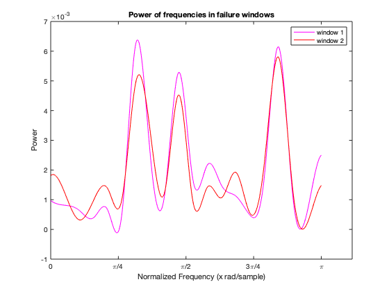

<!DOCTYPE html
  PUBLIC "-//W3C//DTD HTML 4.01 Transitional//EN">
<html><head>
      <meta http-equiv="Content-Type" content="text/html; charset=utf-8">
</head><body>
<h1>PSDsynth</h1><!--introduction-->
Generates a synthetic failure on a non-failure vibrational dataset by leveraging the variations in the PSD (Power Spectral Density) of a failure dataset.
<!--/introduction--><h2>Contents</h2>
<ul><li><a href="#1">Load bearing data</a></li><li><a href="#2">Trim data so only values are present</a></li><li><a href="#3">Trim printer data S to match length of failure data X, takes from middle</a></li><li><a href="#4">Choose parameters for algorithm</a></li><li><a href="#5">Take the Fast Fourier Transform of each window in the failure data and calculate it's power</a></li><li><a href="#6">Take the Fast Fourier Transform of each window in the printer data</a></li><li><a href="#7">Calculate the power density for each bin in each XFFTPow window for the failure data</a></li><li><a href="#8">Get normalized multiplicative terms for each bin in each window in binXFFTpow</a></li><li><a href="#9">Apply normalized multiplicative diff terms to each corresponding frequency in S</a></li><li><a href="#10">Synthesize new signal by taking inverse fourier transform at each window and build up new signal</a></li></ul>
<h2 id="1">Load bearing data</h2><pre class="codeinput">XTable = readtable('bearing_failure_data.csv');
STable = readtable('printer_bearing_data.csv');
</pre><h2 id="2">Trim data so only values are present</h2><pre class="codeinput">X = XTable.value;
S = STable.value;
</pre><h2 id="3">Trim printer data S to match length of failure data X, takes from middle</h2><pre class="codeinput">Lx = length(X);
STrim = S(floor(length(S)/2):floor(length(S)/2)+Lx);

figure(1);
plot(X, 'r');
title('Failure data');
pos1 = get(gcf,'Position');
set(gcf,'Position', pos1 - [300,0,0,0]);
xlabel('Samples');
ylabel('Amplitude');

figure(2);
plot(STrim, 'b');
title('Printer data');
set(gcf,'Position', get(gcf,'Position') + [0,0,0,0]);
pos2 = get(gcf,'Position');
set(gcf,'Position', pos2 + [pos1(3)/2,0,0,0]);
xlabel('Samples');
ylabel('Amplitude');
</pre>  <h2 id="4">Choose parameters for algorithm</h2><pre class="codeinput">windowsize = 40;
stepsize = 1;
numbins = 2;
samplerate = 130;
</pre><h2 id="5">Take the Fast Fourier Transform of each window in the failure data and calculate it's power</h2><pre class="codeinput">XFFTwindpow = zeros(windowsize,1)*(1:floor((Lx-windowsize)/stepsize));
for i = stepsize:stepsize:Lx-windowsize
    XFFTwindpow(:, i/stepsize) = (((abs(fft(X((1+i-stepsize):(1+i-stepsize)+windowsize-1)))).^2) * (1/(samplerate*windowsize)));
end

x = linspace(0, pi, (windowsize)/2);
xv = linspace(0, pi, 10*(windowsize));

y = XFFTwindpow((1:windowsize/2)+1,1);
inter = interp1(x, y, xv, 'spline');
plot(xv, inter, 'm');

y2 = XFFTwindpow((1:windowsize/2)+1, 2);
inter2 = interp1(x, y2, xv, 'spline');
hold on;
plot(xv, inter2, 'r');
hold off;
set(gca, 'XTick', 0:pi/4:pi);
set(gca, 'XTickLabel', {'0', '\pi/4', '\pi/2', '3\pi/4', '\pi'});
title('Power of frequencies in failure windows');
xlabel('Normalized Frequency (x rad/sample)');
ylabel('Power');
legend('window 1', 'window 2');
</pre> <h2 id="6">Take the Fast Fourier Transform of each window in the printer data</h2><pre class="codeinput">SFFTwind = zeros(windowsize,1)*(1:floor((Lx-windowsize)/stepsize));
for i = stepsize:stepsize:Lx-windowsize
    SFFTwind(:, i/stepsize) = fft(STrim((1+i-stepsize):(1+i-stepsize)+windowsize-1));
end

xb = linspace(0, pi, windowsize/2);
yb = real(SFFTwind((1:windowsize/2)+1,1));
</pre><h2 id="7">Calculate the power density for each bin in each XFFTPow window for the failure data</h2><pre class="codeinput">binXFFTpow = zeros(numbins,1)*(1:floor((Lx-(windowsize))/stepsize));
bincols = zeros(numbins, 1);
binsize = floor(windowsize/numbins);
x = 1:windowsize;

for i = 1:floor((Lx-windowsize)/stepsize)
    y = XFFTwindpow(:,  i);
    for j = 1:numbins
        int = cumtrapz(y);
        intv = @(a, b) max(int (x&lt;= b))- min(int (x&gt;=a));
        bincols(j) = intv((1+(j-1)*binsize), (j*binsize));
    end
    binXFFTpow(:, i) = bincols;
end
</pre><h2 id="8">Get normalized multiplicative terms for each bin in each window in binXFFTpow</h2><pre class="codeinput">shiftedbins = cat(2, zeros(size(binXFFTpow,1),1), binXFFTpow);
shiftedbins = shiftedbins(:, 1:end-1);
bindiff = binXFFTpow(:,1:end) - shiftedbins;
normalizeddiff = sqrt((bindiff + real(binXFFTpow)) ./ real(binXFFTpow));
</pre><h2 id="9">Apply normalized multiplicative diff terms to each corresponding frequency in S</h2><pre class="codeinput">YFFTwind = zeros(windowsize,1)*(1:floor((Lx-windowsize)/stepsize));
for i = 1:floor((Lx-windowsize)/stepsize)
    for j = 1:numbins
        YFFTwind(1+((j-1)*binsize):(j*binsize), i) = SFFTwind(1+((j-1)*binsize):(j*binsize), i) .* normalizeddiff(j,i);
    end
end

xa = linspace(0, pi, (windowsize/2));
ya = real(YFFTwind((1:windowsize/2)+1,1));
inter1 = interp1(xb, yb, xv, 'spline');
inter2 = interp1(xa, ya, xv, 'spline');
plot(xv, inter1, 'b');
hold on;
plot(xv, inter2, 'g');
hold off;
set(gca, 'XTick', 0:pi/4:pi);
set(gca, 'XTickLabel', {'0', '\pi/4', '\pi/2', '3\pi/4', '\pi'});
title('Frequency domain of printer data');
xlabel('Normalized Frequency (x rad/sample)');
ylabel('Amplitude')
legend('original window 1', 'synthetic window 1');
</pre> <h2 id="10">Synthesize new signal by taking inverse fourier transform at each window and build up new signal</h2><pre class="codeinput">Y = zeros(Lx, 1);
J = zeros(Lx, 1);

for i = stepsize:stepsize:Lx-windowsize
    x = ifft(YFFTwind(:, i/stepsize));
    J((1+i-stepsize):(1+i-stepsize)+windowsize-1) =  x;
    Y = Y + (J./windowsize) .* stepsize;
    J((1+i-stepsize):(1+i-stepsize)+windowsize-1) = 0;
end
values = real(Y(windowsize:end-windowsize));

figure(1);
plot(values, 'g');
title("Synthetic Data");
pos1 = get(gcf,'Position');
set(gcf,'Position', pos1 - [300,0,0,0])
xlabel('Samples');
ylabel('Amplitude');

figure(2);
plot(STrim, 'b');

title("Original Printer data");
set(gcf,'Position', get(gcf,'Position') + [0,0,0,0]);
pos2 = get(gcf,'Position');
set(gcf,'Position', pos2 + [pos1(3)/2,0,0,0]);
xlabel('Samples');
ylabel('Amplitude');
</pre>  
 <a href="https://www.mathworks.com/products/matlab/">Published with MATLAB&reg; R2019b</a> 

</body></html>
